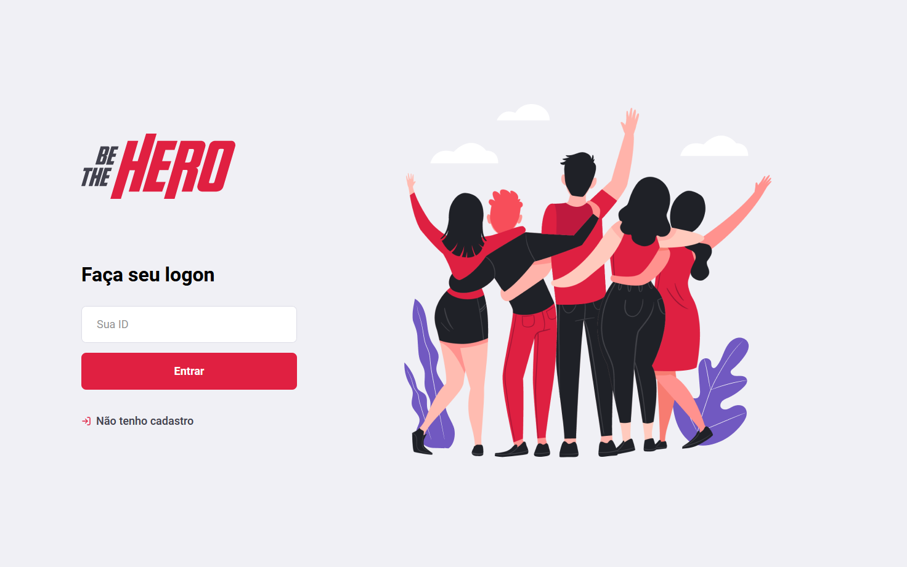
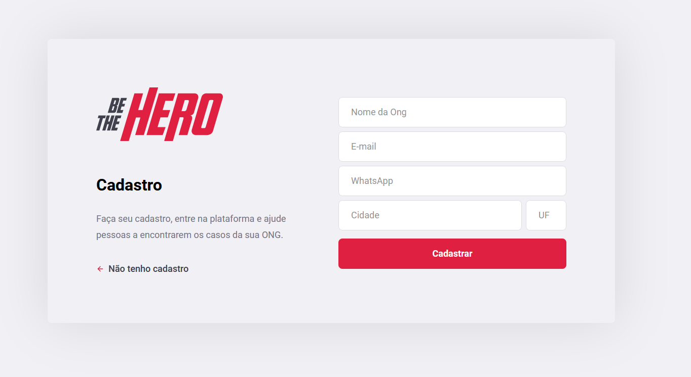
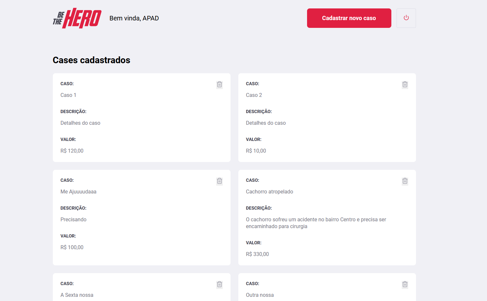
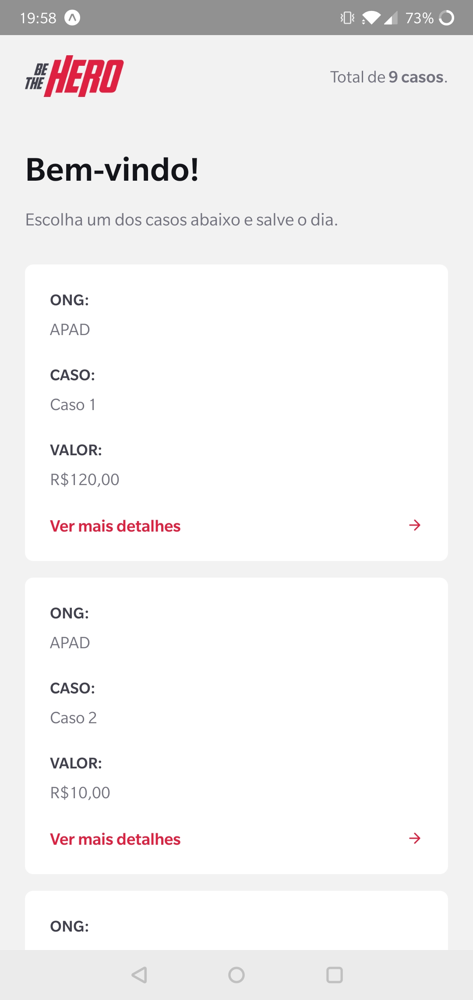
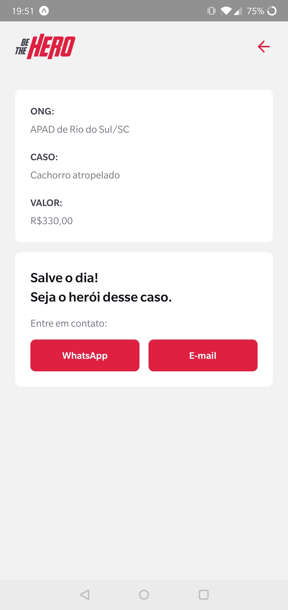

# Semana OmniStack 11

https://rocketseat.com.br

## Projeto

Be the Hero


<br>

<br>

<br>




# Backend

Instalando dependências
```shell
cd backend
npm install
```

Atualizando banco de dados
```shell
cd backend
npx knex migrate:latest
```

Iniciando Servidor (Porta 3333)
```shell
cd backend
npm start
```

Testando
```shell
cd backend
npm test
```

## Rotas

|  Rota | Método|Descrição| Parâmetros | Retorno |
|-------|-------|-|------------|---------|
|`/ongs`| POST  | Cria uma ONG |name<br>email<br>whatsapp<br>city<br>uf| id |
|`/ongs`| GET   | Lista ONGs existentes |n/a| [{id, name, email, whatsapp, city, uf}] |
|`/incidents` | POST | Cria um caso para uma ONG | title<br>description<br>value<br>Authorization(Header)| id |
|`/incidents` | GET  | Lista todos os casos |page(Query, Default=1)|[{id, title, description, value, ong_id, email, whatsapp, city, uf}]<br>X-Total-Count(Header) |
|`/incidents/:id` | DELETE | Deleta um caso | Authorization(Header) | 204 No Content |
| `/profile` | GET | Lista casos de uma ONG | Authorization(Header) |[{id, title, description, value, ong_id}] |
|`/sessions` | POST | Realiza Login | id | name |

# Frontend

Iniciando Servidor
```shell
cd frontend
npm start
```

# Mobile

Iniciando Servidor
```shell
cd mobile
npm start
```